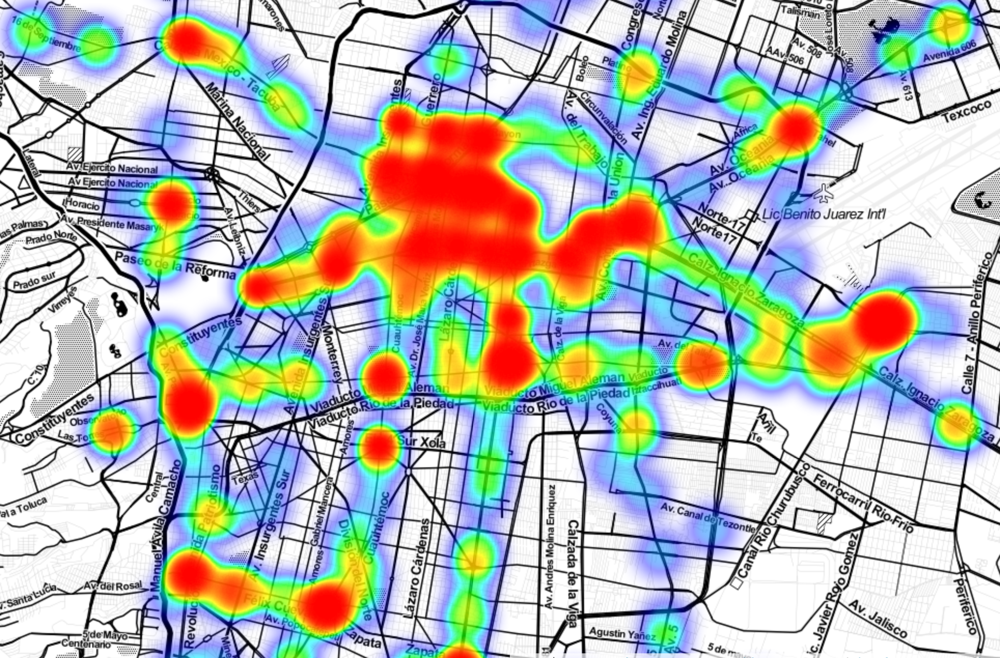
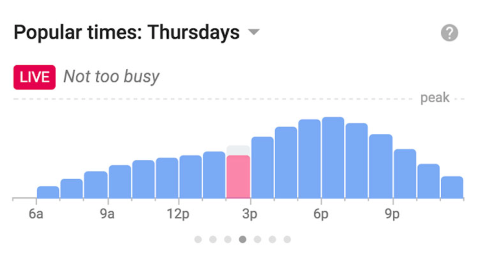
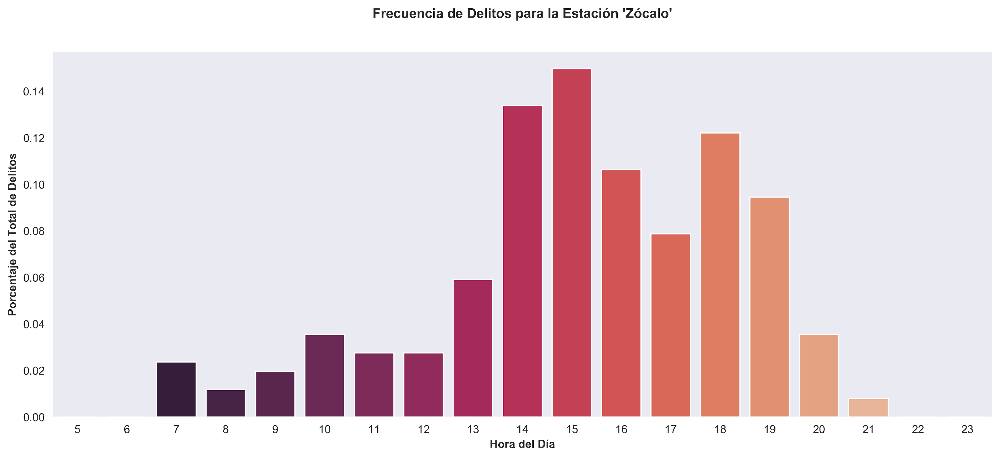

# Proyecto Metro Seguro

El Proyecto [*Metro Seguro*](https://objective-ramanujan-2b11a3.netlify.com) es una aplicación web que te permite descubrir qué tan seguras son las estaciones del metro cerca de ti y las colonias en las que están esas estaciones. Este fue mi proyecto final en el  Data Analytics Bootcamp de Ironhack, y lo realicé junto con [Bernardo López Bautista](https://github.com/anreb/metrop-app), alumno de Web Development en Ironhack.

Como motivación para el proyecto, veamos la siguiente imagen. Es un mapa de calor con los crímenes que se han realizado en las estaciones de Metro en la CDMX. Es fácil ver que hay estaciones más seguras que otras, pero ¿dónde está esa información?

Ya sabemos que Google nos da los horarios más populares, pero ¿quién conoce los horarios más seguros? Nosotros utilizamos la información de los [datos abiertos de la PGJ](https://datos.cdmx.gob.mx/pages/home/) para encontrar patrones y brindarle a los usuarios del Metro información que pudiera mejorar su toma de decisiones. Incluimos también información de las colonias en las que están esas estaciones.

## **Google** 

## **Nosotros**

Dividí el Repo en tres partes —Data Cleaning, Data Processing y Data Analysis—, cada una de las cuales tiene su propio README. 
